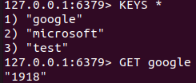

<div style="position: absolute; top: 0px; right: 0px;">
    
</div>

<div style="height: 150px"></div>

# Django(python) Redis caching Example

Show how the redis works with Django(Python).

# Redis rate-caching example front


# Redis rate-caching example (command line)



## Try it out
<p>
    <a href="https://heroku.com/deploy" target="_blank">
        
    <a>
</p>
<p>
    <a href="https://vercel.com/new/git/external?repository-url=https://github.com/deliveryweb/redis-caching-python/tree/dev&env=REDIS_HOST,REDIS_PORT,REDIS_PASSWORD" target="_blank">
        
    </a>
</p>
<p>
    <a href="https://deploy.cloud.run/?dir=google-cloud-run" target="_blank">
        
    </a>
</p>


### How to run it locally?

### Run docker compose or install redis manually
Install docker (on mac: https://docs.docker.com/docker-for-mac/install/)

```sh
docker network create global
docker-compose up -d --build
```

#### If you install redis manually open django-backend/configuration folder and copy `.env.example` to create `.env`. And provide the values for environment variables
    - REDIS_HOST: Redis server host
    - REDIS_PORT: Redis server port
    - REDIS_DB: Redis server db index
    - REDIS_PASSWORD: Redis server password

#### Setup and run backend
Install python, pip and venv (on mac: https://installpython3.com/mac/)

Use python version: 3.8
``` sh
python3 -m venv venv
source ./venv/bin/activate
pip3 install -r requirements.txt
python3 manage.py collectstatic
gunicorn configuration.asgi:application -b 127.0.0.1:5000 -k uvicorn.workers.UvicornWorker
```
